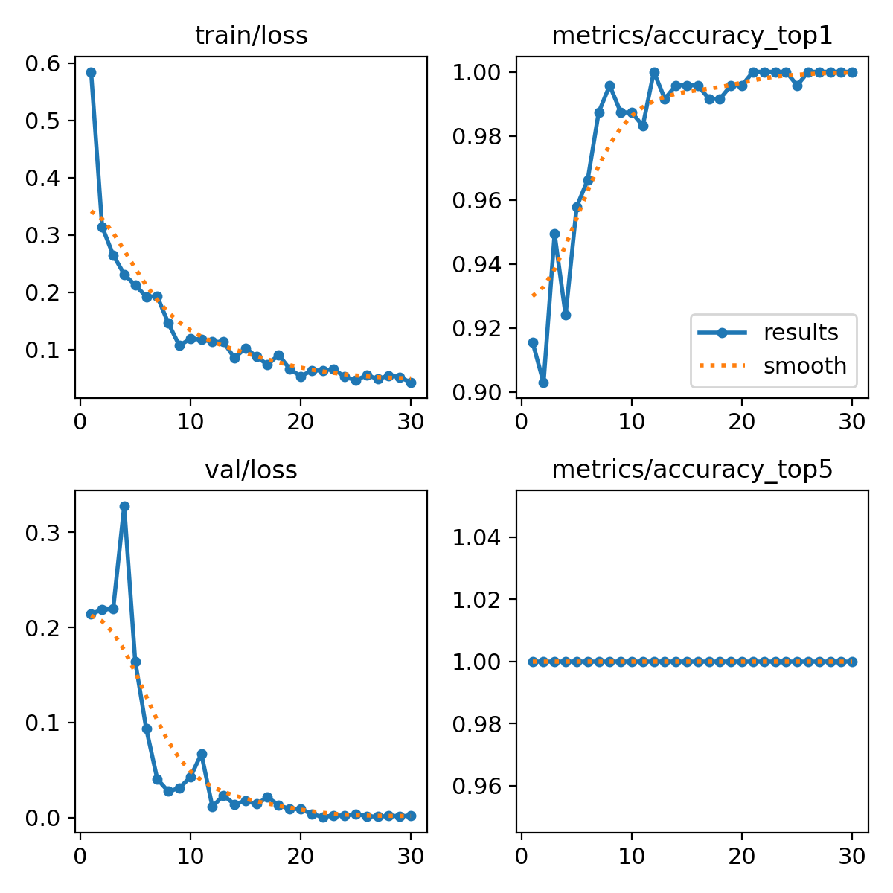
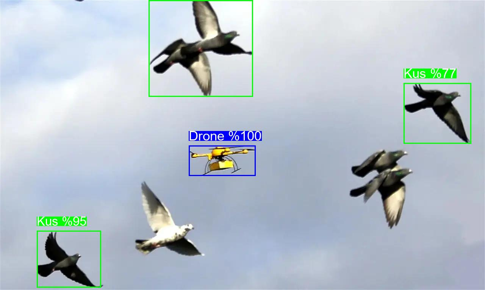
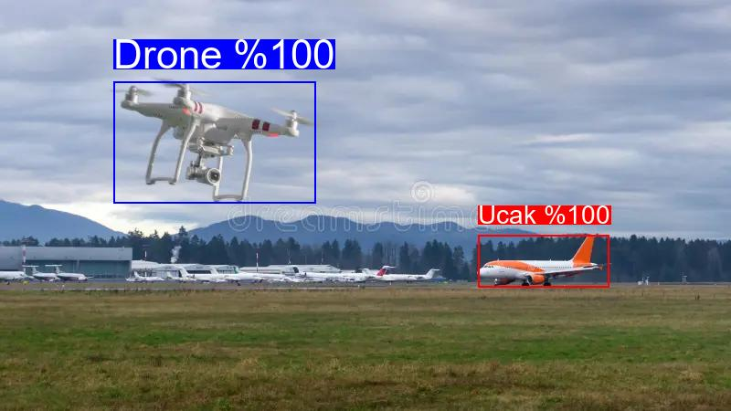

# Hava tespit (Drone, Kuş, Uçak)

Gökyüzündeki droneları tespit etmek ve diğer tüm hava araçlarını ve kuşları sınıflandırmak için bu proje geliştirildi

1. **Model 1 (Detector):** "Gökyüzünde bir obje var mı? Nerede?" (Sadece kutu çizer)
2. **Model 2 (Classifier):** "O kutunun içindeki şey tam olarak ne?" (Crop edilen resmi sınıflandırır)

## 📊 Eğitim Süreci ve Model Çıktıları

Tespit veriseti (model 1) : https://www.kaggle.com/datasets/banderastepan/drone-detection
Sınıflandırma veriseti (model 2): https://www.kaggle.com/datasets/maryamlsgumel/drone-detection-dataset?select=BirdVsDroneVsAirplane

### 1. Aşama: Nesne Tespiti
Sadece gökyüzündeki hareketli/sabit objeleri yakalamaya odaklanır.
* **Model:** YOLOv8n (Nano)
* **Epoch:** 100
* **Başarı (mAP@50):** %96.6

### 2. Aşama: Sınıflandırma (Image Classification)
İlk modelin bulup kestiği (crop) görüntüleri alıp 3 sınıfa (Drone, Bird, Aeroplane) ayıran model.
* **Model:** YOLOv8n-cls
* **Epoch:** 30
* **Başarı (Top-1 Accuracy):** %99.2

SINIFLANDIRMA GRAFİĞİ:
 

## 🚀 Sonuçlar

Sistemin yan yana geçen kuşlar ve uçaklar üzerindeki gerçek test sonuçları:

<p float="left">
  
   
</p>

## 💻 Kurulum ve Kullanım

Sistemi kendi bilgisayarınızda çalıştırmak için:

```bash
# Kütüphaneleri kurun
pip install -r requirements.txt

# Test etmek istediğiniz resmi main.py içinde belirtip çalıştırın
python main.py